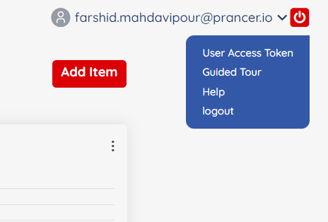
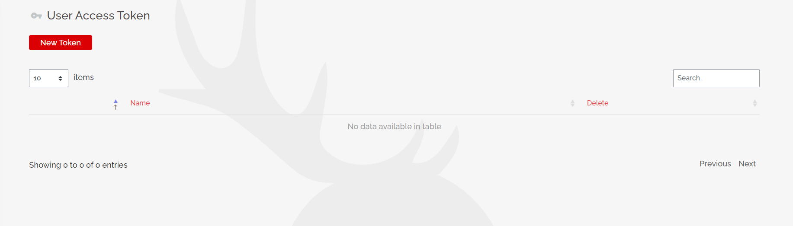
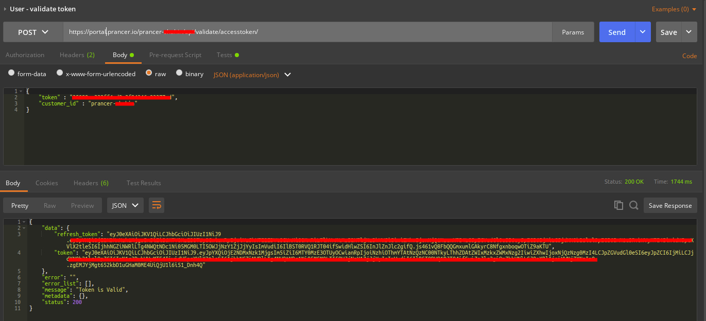
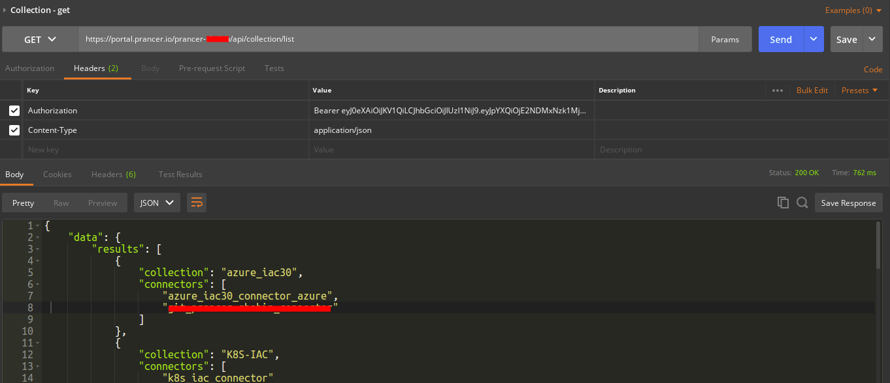
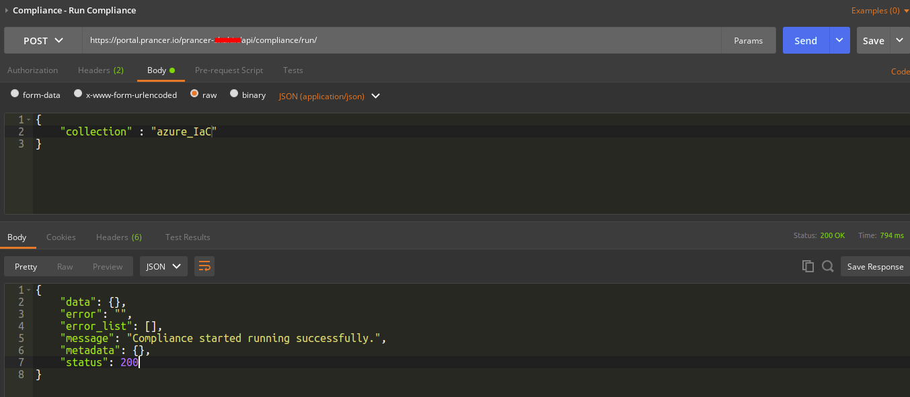

**How to use Prancer Enterprise APIs**
===

Here are the steps to generate an access token and access prancer enterprise APIs.

## 1) Generate API Token:

API tokens are being used to connect to the Prancer tenant programmatically. You can generate multiple tokens for different purposes.
the following use cases can be covered by generating tokens:

 - connecting to Prancer API
 - running VSCode extension
 - connecting from CI tools

### How to generate tokens
Login to the Prancer Portal, On the user menu (top right), select the drop-down menu and select `User Access Token`.

Click on `New Token` to generate a new token. Make sure you keep the token somewhere safe, you cannot retrieve it when you close the page.

## 2) Call the authentication API

Call [Validate Access Token](authentication.md#validate-access-token) API to validate your token and get the authenticated JWT Bearer token to access APIs.

## 3) Access the Prancer Enterprise API

You got the authenticated `JWT Bearer token` by calling Validate Access Token API. Now you can use it to call APIs of Prancer Enterprise. For example,

- Call the [Get Collection List](collection.md#collection-get) API to get all collections list.

- Call the [Run compliance](compliance.md#compliance-run-compliance) API to run compliance on a collection.

