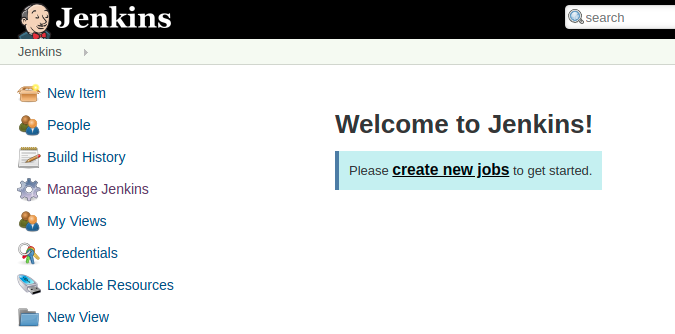
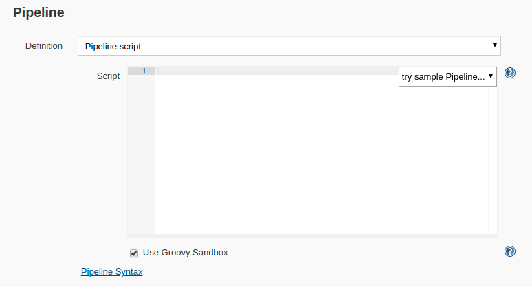
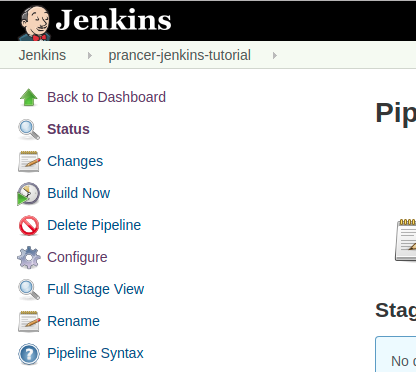
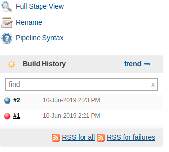
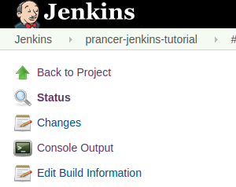
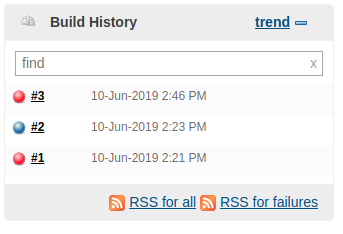

This tutorial will show you all the steps required to setup a basic **Jenkins** CI server that could leverage **Prancer** as a step. This tutorial doesn't show how to use **Prancer** but more how to use it in a CI/CD setup such as **Jenkins**.

Before taking this tutorial, you will need to follow some more generic steps:

1. First, let's [install Docker](https://docs.docker.com/install/) to avoid installing **Jenkins** directly on our system

Then, you can follow these steps:

1. Setup a **Jenkins** server
2. Create a **Prancer** project where our files will exist
3. Create a **Jenkins** job
4. Run the job
5. Trigger a failure
6. Cleanup and rejoice

# Setup a **Jenkins** server

## Get the Jenkins container running

> <NoteTitle>Previous runs</NoteTitle>
>
> If you are restarting this tutorial and already ran it before, you will not have the administrator password shown. You will need to `docker volume rm jenkins_home` to start from scratch.

To get our integration running, we need a **Jenkins** server. Let's start one using **Docker**:

    docker network create prancer

    docker run -p 8080:8080 --name prancer-jenkins-tutorial --network prancer -p 50000:50000 -v jenkins_home:/var/jenkins_home jenkins/jenkins:lts

Feel free to change the mapped ports, volume or network.

Once the server has started, look at the log for the administrator password. It should look something like:

    *************************************************************
    *************************************************************
    *************************************************************

    Jenkins initial setup is required. An admin user has been created and a password generated.
    Please use the following password to proceed to installation:

    e6013bfc6f034d2d8b47c7b56d129955

    This may also be found at: /var/jenkins_home/secrets/initialAdminPassword

    *************************************************************
    *************************************************************
    *************************************************************

Copy this string in memory, you will need it in a few seconds.

Once **Jenkins** is ready (you should see a "Jenkins is fully up and running" in the log), visit the [server](http://localhost:8080). It will ask you to unlock your **Jenkins** server. Paste in the code you copied from the log. Then, following the instructions below:

1. Click on `Install suggested plugins`
2. Create an `admin` user (Keep it simple for this demo, we suggest to use `admin` for both username and password)
3. Set the proper URL if not properly set
4. Confirm the start of **Jenkins**

## Get a MongoDB container running

The next step is to create a **MongoDB** server to store your results. We'll add that to the previously created **Docker** network:

    docker run -d --name prancer-mongodb-server -it --network prancer mongo

Later, you will have to configure the `dburl` in your configuration file to:

    dburl=mongodb://prancer-mongodb-server:27017/validator

Thats it, you now have a dockerized **MongoDB** server.

## Configure the master / slave node with Prancer

The final step to setting up your instance is to install **Prancer** on the master / slave node (The **Jenkins** server). We named our node `prancer-jenkins-tutorial`, using the `--name` switch, we can execute simple root commands to install **Prancer** on that container.

    # Update your container's apt cache
	docker exec -itu 0 prancer-jenkins-tutorial apt update -y

    # Install python and pip
    docker exec -itu 0 prancer-jenkins-tutorial apt install -y python3 python3-pip

    # Install prancer-basic and upgrade some modules
    docker exec -itu 0 prancer-jenkins-tutorial pip3 install prancer-basic
    docker exec -itu 0 prancer-jenkins-tutorial pip3 install --upgrade pyasn1-modules

At this point, your master node should be setup properly to run Prancer!

> <NoteTitle>Alternatives</NoteTitle>
>
> There are other ways to install **Prancer** on your master node but this is a straighforward and easy to undertand way. The better approach would be to use slave nodes which we'll cover in a later tutorial.

# Create a Prancer project

Next, we'll need a prancer project where we store our json file that will be tested. Open a new directory and create the sub directories and the `template.json` file with the following content. If you have cloned our repository as previously suggested, you don't need to do this but you can look at the instructions.

First run:

    cd "<root-directory-of-your-project>"
    mkdir -p tests/prancer/validation/git
    mkdir -p data

Then, let's create the content for each file:

**data/config.json**

    {
        "webserver": {
            "port": 80
        }
    }

**tests/prancer/project/.gitignore**

    log/*
    *.log
    output-*json

**tests/prancer/project/config.ini**

    [LOGGING]
    level = DEBUG
    propagate = true
    logFolder = log
    dbname = whitekite

    [MONGODB]
    dburl = mongodb://prancer-mongodb-server/validator
    dbname = validator

    [REPORTING]
    reportOutputFolder = validation

    [TESTS]
    containerFolder = validation
    database = false

**tests/prancer/project/gitConnector.json**

    {
        "fileType": "structure",
        "companyName": "prancer-test",
        "gitProvider": "https://github.com/prancer-io/prancer-docker-tutorial.git",
        "branchName":"master",
        "private": false
    }

> <NoteTitle>Changes</NoteTitle>
>
> Remember to substitute the **gitProvider** with your own!

**tests/prancer/project/validation/git/snapshot.json**

    {
        "fileType": "snapshot",
        "snapshots": [
            {
                "source": "gitConnector",
                "type": "git",
                "testUser": "git",
                "nodes": [
                    {
                        "snapshotId": "1",
                        "type": "json",
                        "collection": "security_groups",
                        "path": "data/config.json"
                    }
                ]
            }
        ]
    }

**tests/prancer/project/validation/git/test.json**

    {
        "fileType": "test",
        "snapshot": "snapshot",
        "testSet": [
            {
                "testName ": "Ensure configuration uses port 80",
                "version": "0.1",
                "cases": [
                    {
                        "testId": "1",
                        "rule": "{1}.webserver.port=80"
                    }
                ]
            }
        ]
    }

Then, commit this setup to a repository that is accessible using git such as on GitHub. Note that you must create the repository beforehand.

    git init
    git remote add origin git@github.com:your-user/some-repo.git
    git add .
    git commit -m "Tutorial on jenkins"
    git push

Following this, you should be able to see your code on your repository.

# Create a **Jenkins** job

Back to **Jenkins**, you can now create your first job. A job is what runs a certain set of operations. In our case, we'll make it very simple and only run **Prancer** on some checked out code but in a more complex scenario, you'd have many other steps to run before hand. 

Let's create a job:

1. Visit the [Jenkins server](http://localhost:8080)
2. Login if necessary
3. Click on "Create new jobs"

    

4. Name your job something like "prancer-jenkins-tutorial" and select the "Pipeline" type and click "Ok"
5. Skip down to the last section and paste the following pipeline script into the pipeline box:

    

**Pipeline script**

    pipeline { 
        agent any 
        options {
            skipStagesAfterUnstable()
        }
        stages {
            stage('Build') { 
                steps { 
                    git url: 'https://github.com/prancer-io/prancer-jenkins-tutorial.git',
                        branch: 'master'
                }
            }
            stage('Test'){
                steps {
                    dir("tests/prancer/project") {
                        sh "prancer git"
                    }
                }
            }
        }
    }

Remember to update the git url with the url to your repository! Once done, save the job and you should be back to the job dashboard!

# Run the job

Now let's run the job to ensure the test works:

1. Go to the job's page (Something like [http://localhost:8080/job/prancer-jenkins-tutorial/](http://localhost:8080/job/prancer-jenkins-tutorial/))
2. Clicking on the "Build now" button on the side bar

    

This will trigger a build and within seconds, thanks to our very simple project, you should have a passing build. Let's check the logs!

1. Click on the date beside the last build you ran in the build history

    

2. Click on "Console Output"

    

3. Look at the log

It should show the same log as if you ran **Prancer** from your machine but instead it was run as a CI job on your **Jenkins** server.

    2019-06-10 14:23:47,962(interpreter: 209) - ###########################################################################
    2019-06-10 14:23:47,963(interpreter: 210) - Actual Rule: {1}.Resources.PrancerTutorialSecGroup.Properties.SecurityGroupIngress['FromPort'=22].CidrIp= '172.16.0.0/16'
    2019-06-10 14:23:47,965(interpreter: 219) - **************************************************
    2019-06-10 14:23:47,966(interpreter: 220) - All the parsed tokens: ["{1}.Resources.PrancerTutorialSecGroup.Properties.SecurityGroupIngress['FromPort'=22].CidrIp", '=', "'172.16.0.0/16'"]
    2019-06-10 14:23:47,967(rule_interpreter:  35) - {'dbname': 'validator', 'snapshots': {'1': 'security_groups'}}
    2019-06-10 14:23:47,967(rule_interpreter:  36) - <class 'dict'>
    2019-06-10 14:23:47,967(rule_interpreter:  78) - Regex match- groups:('1', ".Resources.PrancerTutorialSecGroup.Properties.SecurityGroupIngress['FromPort'=22].CidrIp"), regex:\{(\d+)\}(\..*)*, value: {1}.Resources.PrancerTutorialSecGroup.Properties.SecurityGroupIngress['FromPort'=22].CidrIp, function: <bound method RuleInterpreter.match_attribute_array of <processor.comparison.comparisonantlr.rule_interpreter.RuleInterpreter object at 0x7f023e7f0d30>> 
    2019-06-10 14:23:47,968(rule_interpreter: 121) - matched grps: ('1', ".Resources.PrancerTutorialSecGroup.Properties.SecurityGroupIngress['FromPort'=22].CidrIp"), type(grp0): <class 'str'>
    2019-06-10 14:23:47,969(rule_interpreter: 150) - Number of Snapshot Documents: 1
    2019-06-10 14:23:47,969(rule_interpreter:  78) - Regex match- groups:(), regex:\'.*\', value: '172.16.0.0/16', function: <bound method RuleInterpreter.match_string of <processor.comparison.comparisonantlr.rule_interpreter.RuleInterpreter object at 0x7f023e7f0d30>> 
    2019-06-10 14:23:47,970(rule_interpreter: 169) - LHS: 172.16.0.0/16, OP: =, RHS: 172.16.0.0/16

You can see here, in the last rule interpreted, that the LHS is **172.16.0.0/16** so the comparison between **172.16.0.0/16** and **172.16.0.0/16** passes and so the test succeeds.

# Trigger a failure

Now that we have a working example, let's simulate a failure by changing the test that is run with another that cannot succeed:

1. Go to the job's page (Something like [http://localhost:8080/job/prancer-jenkins-tutorial/](http://localhost:8080/job/prancer-jenkins-tutorial/))
2. Click on the `Configure` option in the sidebar

    

3. Go down to the pipeline script and change it to:

**Pipeline script**

    pipeline { 
        agent any 
        options {
            skipStagesAfterUnstable()
        }
        stages {
            stage('Build') { 
                steps { 
                    git url: 'https://github.com/prancer-io/prancer-jenkins-tutorial.git',
                        branch: 'fails'
                }
            }
            stage('Test'){
                steps {
                    dir("tests/prancer/project") {
                        sh "prancer git"
                    }
                }
            }
        }
    }

Now let's run the job to ensure the test fails:

1. Go to the job's page (Something like [http://localhost:8080/job/prancer-jenkins-tutorial/](http://localhost:8080/job/prancer-jenkins-tutorial/))
2. Clicking on the "Build now" button on the side bar

    

This will trigger a build and within seconds, thanks to our very simple project, you should have a passing build. Let's check the logs!

1. Click on the date beside the last build you ran in the build history

    

2. Click on "Console Output"

    

3. Look at the log

It should show the same log as if you ran **Prancer** from your machine but instead it was run as a CI job on your **Jenkins** server.

    ###########################################################################
    2019-08-12 14:22:03,680(interpreter: 210) - Actual Rule: {1}.webserver.port=80
    2019-08-12 14:22:03,697(interpreter: 219) - **************************************************
    2019-08-12 14:22:03,698(interpreter: 220) - All the parsed tokens: ['{1}.webserver.port', '=', '80']
    2019-08-12 14:22:03,698(rule_interpreter:  35) - {'snapshots': {'1': 'security_groups'}, 'dbname': 'validator'}
    2019-08-12 14:22:03,698(rule_interpreter:  36) - <class 'dict'>
    2019-08-12 14:22:03,699(rule_interpreter:  78) - Regex match- groups:('1', '.webserver.port'), regex:\{(\d+)\}(\..*)*, value: {1}.webserver.port, function: <bound method RuleInterpreter.match_attribute_array of <processor.comparison.comparisonantlr.rule_interpreter.RuleInterpreter object at 0x7f9d90845748>> 
    2019-08-12 14:22:03,699(rule_interpreter: 121) - matched grps: ('1', '.webserver.port'), type(grp0): <class 'str'>
    2019-08-12 14:22:03,700(rule_interpreter: 150) - Number of Snapshot Documents: 1
    2019-08-12 14:22:03,701(rule_interpreter:  78) - Regex match- groups:('80', None), regex:(\d+)(\.\d+)?, value: 80, function: <bound method RuleInterpreter.match_number of <processor.comparison.comparisonantlr.rule_interpreter.RuleInterpreter object at 0x7f9d90845748>> 
    2019-08-12 14:22:03,701(rule_interpreter: 169) - LHS: 8080, OP: =, RHS: 80

You can see here that the LHS is 8080 and it is compared to 80 so the test fails.

# Cleanup and rejoice

If you followed this tutorial without altering the resources to create, then it should be relatively easy to cleanup, here is a list:

1. Kill the **Jenkins** docker container, you can simply `CTRL+C` out of it
2. Destroy the docker container: `docker rm prancer-jenkins-tutorial`
3. Destroy the docker volume: `docker volume rm jenkins_home`
4. Destroy the **MongoDB** container: `docker stop prancer-mongodb-server` && `docker rm prancer-mongodb-server`
5. Destroy the network: `docker network rm prancer`
6. Destroy the useless repositories such as `prancer-tests` and `prancer-cicd-tutorial` if you used your own

# Conclusion

That's it, you are done. You now know how to setup a basic `Prancer` test in **Jenkins**.

Things to remember:

1. **Prancer** exits with a proper exit code regarding success or failure. This means that any CI server, not just **Jenkins**, will catch the error code and stop right there if it receives an exit code that is not 0.
2. Running **Prancer** from a CI doesn't do anything else than if you ran it from your machine, you still need to build your tests and ensure they work beforehand.
3. Running tests without saving the artifacts of the tests, mostly when there are failures, will make it harder to figure out what failed. Read on the next tutorials to learn how to save your artifacts for later review.

Thank you for completing this tutorial on **Prancer**.

We hope to see you in the next tutorial!