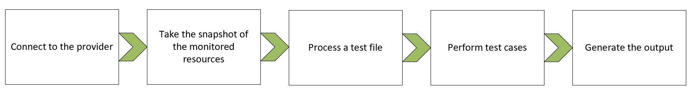

# Prancer Workflow

**Prancer** expects its configuration files to be available on your system to complete its workflow.
We have two options to get up and running with the Prancer platform:
    - Easy way
    - Hard way

# prancer workflow: the easy way
The easiest way (recommended way) is to clone the `Hello World!` application and build your project around that.

> you can find the detail of the `Hello World` application [here](https://github.com/prancer-io/prancer-hello-world)

You can modify the files in the `Hello World` application and add your files based on the project you are working on. This is the easiest and fastest way to get you up and running with the Prancer platform

# prancer workflow: the hard way
Based on your project structure, you can create the required files and folders and put the config files there.

## Setup the framework

Working with **Prancer** itself is a straightforward activity and needs only a few steps:

### Prancer Basic Workflow
1. Create a **Prancer** project directory in your application's project directory
2. Configure the connectors for each required provider
3. Create collections
4. Use existing `snapshot configuration` files
5. Use existing `test` files based on available compliance
6. Add optional exclusions to skip tests based on resources, tests, or combination of both
7. Run the tests

Some of these steps are more involved than others, but the general workflow is straightforward to understand to keep the learning curve as simple as possible.

# Running compliance tests

Running a test and gathering results was kept to the most simple steps possible so that integration into an existing continuous improvement/continuous deployment pipeline stays as simple as possible. The last thing you want is to use a cumbersome tool:

1. Checkout your application project
2. Go to the **Prancer** project directory
3. Run the prancer platform and act on return code
4. Save the outputs as artifacts for later viewing

Integrating with a CI/CD pipeline can be as simple as running a simple **BaSH** script in a folder with an `if` statement around it to catch potential failures. With the files written to disk, you can then dig into the results as you want by parsing the simple **JSON** files. 

# The validation workflow

Each time the tool is running, the test suite is executed sequentially:

1. Configuration files are read (Project configuration, Connector configuration, Snapshot configuration, Tests)
2. Providers are communicated with, snapshots are built and then saved to the database
3. Tests run against the snapshots
4. Reports are produced

